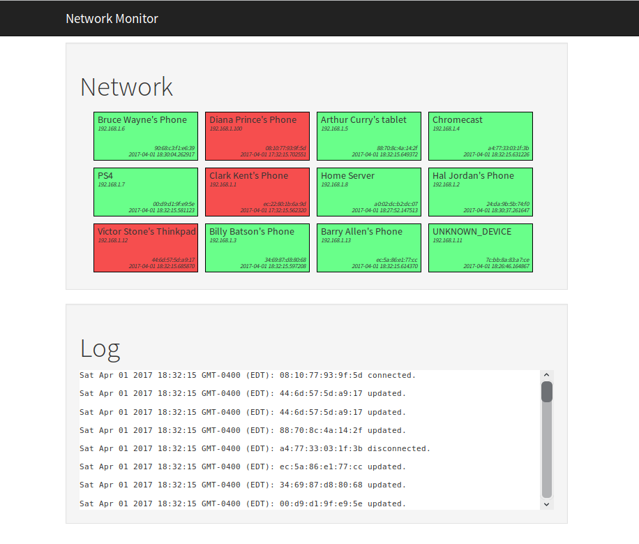

  Network Monitor
  ===============

  ### About

Living in a house with a lot of people who are always coming and going has given me the impression that it would be useful to know who is home at any given time. In this modern age, it can be said that the question 'who is home?' is synonymous with the question 'who's mobile device is connected to the home network?'. Rephrasing the question in this manner inspired me to develop this project.

A brief survey of established protocols that can help us to answer this question will quickly yeild ARP (Address Resolution Protocol). ARP is a protocol used by the Internet Protocol (IP) to map IP network addresses to the hardware addresses used by a data link protocol. In summary, using ARP will tell us what devices are on the network and their MAC addresses.

Using this knowledge, I wrote a Python script (check_connections.py) that uses ARP to determine what devices are on my network. Of course, having a MAC address alone will not tell a user what device belongs to whom so I then mapped out MAC addresses with a given alias; such as 11:22:33:44:55:66 belongs to Bob.

At first I made the script play a noise and speak out the name of the device every time a new device would connect to the network. As you can imagine, it did not take long before it proved to be an annoyance. As a result, I thought it more intuitive to build a web application that can simply display to me and other members of my home who is home and who is not. 

Thus, I built a nodejs application that incorporates an API which the python script can broadcast to. The nodejs application then uses redis to store the information locally. By using websockets between the nodejs server app and the view, i can also live update the page. As a result, I can now leave this page open at all times on my machine and know at any time what devices are connected to the network.

The nodejs application is also password protected (via HTTP auth) which allows the user to port forward from their router so that he or she can also check the application when not at home.

  
  ### Python Script (src/check_connections.py)

The main python script is called check_connections.py. It uses ARP to determine who is on the same network. The usage is as follows:

    usage: check_connections.py [-h] [-g G] [-f F] [-e E]

    optional arguments:
      -h, --help  show this help message and exit
      -g G        specify a gateway. default gateway will be 192.168.1.1
      -f F        specify a JSON file with device names and their corresponding
                  MAC addresses. Format should be [{"device": "some device",
                  "MAC":"some mac"}]. default will be mac_addresses.json
      -e E        specify a text file containing MAC addresses to exclude from
                  monitoring. text file must have one MAC address per line.
                  default file will be blacklist.txt

It can be customized via the global variables found towards the top of the script:

    loop_seconds = 30  # seconds to wait in between each monitor loop
    disconnect_time = 1800  # time to wait before client is rendered disconnected
    __checking = False  # flag that indicates whether or not to notice new connections
    __broadcast = True  # toggle for broadcasting to a web service
    __writing = False  # toggle for writing connections to a file
    __speak = False  # flag for speaking when a new device connects
    __log_unknown = True  # flag to indicate whether to log unknown devices
    __printing = False # flag to indicate if script prints output
    connected_file = "resources/connected_file.json"  # file to log connections
    log_file = "/src/resources/unknown_connections.log"  # log file for unkown devices
    mac_file = "resources/mac_addresses.json" # file for mac addresses
    web_service_url = "http://127.0.0.1:3000/api/connections"  # web service url

  #### Mapping MAC addresses (src/resources/mac_addresses.json)
Please note that the script will attempt to read a JSON file (mac_addresses.json) that contains the mac addresses and aliases of the devices on your network. It's format should be as follows:

    [
      {
        "device": "Bruce Wayne's Phone",
        "MAC": "24:DA:9B:5B:74:F0"
      }, {
        "device": "Spike Spigel's Phone",
        "MAC": "00:16:cf:af:75:e8"
      }
    ]

  #### Blacklist (src/resources/blacklist.txt)
  I implemented a blacklist feature to keep from monitoring undesired devices on the network such as a chromecast or router, etc. A blacklist file should be a plain textfile with a MAC address on each line like so:

    24:DA:9B:5B:74:F0
    00:16:cf:af:75:e8
    
#### Security (Node application)
The web application is protected via HTTP auth. One can customize the users with access in node_app/server.js via the admins object:

    // http authentication
    let auth = require("basic-auth");
    let admins = { // define admins here
        'admin': { password: 'password' }
    };
    
### Executing
The entire application can be executed with docker-compose and will run on localhost:3000. The docker-compose command to build and run the application is as follows:

    docker-compose up --build
